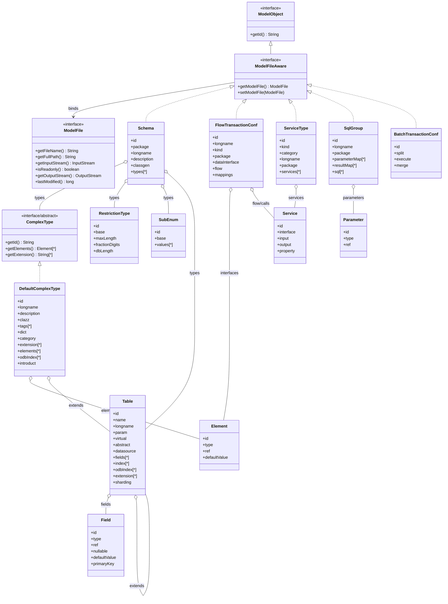

# APS 元模型规则与模型目录

> 版本：0.16.0
> 适用基线：APS 6.51.173 / `aps-maven-6.51.16-RELEASE`
> 真实样例工程：`/Users/joshua/code/v8.7-all`
> 证据原则：本文只记录已从框架源码、模型注册表和真实 XML 交叉验证的信息；未验证项明确标注。

## 1. 文档范围

本文是 APSGraph 和后续 APS 元数据可视化实现使用的规则基线，覆盖：

- 核心模型对象契约；
- 顶层模型与普通模型的边界；
- XML 文件后缀与根节点映射；
- Schema、类型、字段、表、服务、交易、Named SQL 等模型层次；
- 模型关联 XML 的来源和定位规则；
- 模型关系、类型引用和继承规则；
- UML 类图；
- 顶层模型清单、普通模型清单；
- 真实 XML Demo；
- APSGraph 扫描器与 APS 原生加载器的差异。

## 2. 核心概念

### 2.1 ModelObject

源码：

```text
aps-framework-6.51.173-RELEASE/aps-foundation/aps-component-api/
src/main/java/cn/sunline/aps/common/metadata/model/ModelObject.java
```

```java
public interface ModelObject {
    String getId();
}
```

框架旧模型工具中的同名契约额外继承 `Serializable`：

```java
public interface ModelObject extends Serializable {
    String getId();
}
```

规则：

1. 模型对象必须具有可识别的 `id`；
2. `id` 是局部模型身份，不等于全局 `fullId`；
3. XML 属性、模型引用和生成代码需要通过 `id`/`fullId` 交叉校验；
4. 没有稳定身份的 XML 容器不应被当作独立业务模型。

### 2.2 ModelFileAware

```java
public interface ModelFileAware extends ModelObject {
    ModelFile getModelFile();
    void setModelFile(ModelFile file);
}
```

语义：

```text
一个 ModelFileAware 顶层对象 ↔ 一个 APS 模型 XML 文件
```

`ModelFile` 提供：

```text
getFileName()
getFullPath()
getInputStream()
isReadonly()
getOutputStream()
lastModified()
```

因此顶层模型必须同时拥有：

```text
模型身份
文件身份
```

APSGraph 对应：

```text
model_files → 文件证据
nodes(owner_node_id IS NULL) → 顶层模型
```

### 2.3 ModelObject 与 ModelFileAware 的边界

```text
ModelFileAware
  └── ModelObject
```

顶层对象通常实现 `ModelFileAware`；文件内嵌套对象实现 `ModelObject` 或由 `ModelObject` 语义承载。

例如：

```text
ApBatchTemplate.nsql.xml
  └── SqlGroup       (顶层 ModelFileAware)
        ├── Parameter
        ├── ParameterMap
        ├── ResultMap
        └── Named SQL
```

## 3. 建模原则

### 3.1 文件是顶层边界

文件边界由 `ModelFileAware` 定义，而不是由目录名称定义。

```text
一个模型文件
  → 一个顶层模型对象
  → 多个嵌套语义对象
```

### 3.2 顶层模型与普通模型分离

顶层模型：

- 与物理 XML 文件绑定；
- 通常具有 XML 根节点；
- 可以被 MavenModelLoader 直接加载；
- 进入全局模型缓存和文件级索引。

普通模型：

- 位于顶层模型内部；
- 通过 `owner`/集合关系挂载；
- 可以有自己的 `id`/`fullId`；
- 不应被误认为独立文件。

### 3.3 Schema 是类型容器

`schema` 根对象用于承载：

```text
DefaultComplexType
RestrictionType
SubEnum
Table
```

当前框架源码：

```java
@CollectionMember({
    DefaultComplexType.class,
    RestrictionType.class,
    SubEnum.class,
    Table.class
})
private List<ElementType> types;
```

因此一个 Schema 文件可能同时包含：

```text
复合类型
限制类型
枚举
字典
数据库表
```

### 3.4 字典是复合类型的一种语义

`DefaultComplexType` 具有：

```java
Boolean dict;
```

规则：

```text
dict=true  → 字典
其他       → 普通复合类型
```

字典不应被当成与复合类型完全无关的根模型。

### 3.5 类型引用与语义引用分离

一个字段可以同时存在：

```xml
type="Base.U_NAME"
ref="DemoDict.A.name"
```

含义不同：

```text
type → 数据类型/结构类型
ref  → 字典、业务语义或其他模型引用
```

APSGraph 必须建立不同关系：

```text
TYPE_REF
DICT_REF
```

不能合并成普通 `REFERENCE`。

### 3.6 继承支持多父类型

`extension` 表示父类型/复用结构，框架源码允许数组：

```java
private String[] extension;
private ComplexType[] extensionType;
```

一个模型可以扩展多个父模型：

```text
ComplexType
  ├── EXTENDS → Base.A
  └── EXTENDS → Base.B
```

### 3.7 元数据与生成代码分离

元数据源：

```text
src/main/resources/**/*.xml
```

生成产物：

```text
target/gen/**/*.java
target/classes/**/*.xml
```

规则：

- 源 XML 是模型定义证据；
- `target/gen` 是生成代码验证证据；
- `target/classes` 是构建复制物，不应作为业务源重复统计；
- 生成代码不能反向覆盖 XML 模型。

### 3.8 解析和运行时加载是两件事

APS 原生链路：

```text
MavenModelLoader
  → ModelFactoryUtil.parse
  → XmlConfigManager/JAXB
  → ModelFileAware 绑定 ModelFile
  → 模型缓存/关系解析
  → 校验/代码生成
```

APSGraph 链路：

```text
识别后缀
  → ElementTree 解析
  → 顶层/语义节点投影
  → SQLite nodes/edges
```

APSGraph 的规则应尽量与原生结果交叉验证，但不能声称已经完整复刻 JAXB、代理、缓存和运行时解析语义。

## 4. UML 类图



> 说明：图中 `ComplexType`、`Element`、`Service` 等是基于 APS 源码和真实 XML 的核心关系抽象；不同 6.x/V8 版本可能存在额外实现类或别名，具体以版本源码为准。

## 5. 顶层模型清单

以下清单来自 `IDEConstants.allModelList`，是 APS Maven/JAXB 模型加载器的顶层模型注册表。

| 顶层 Java 模型 | XML 根/主要后缀 | 业务含义 |
|---|---|---|
| `FlowTransactionConf` | `flowtran` / `.flowtrans.xml` | 流程交易 |
| `WorkflowDef` | workflow / `.workflow.xml` | 工作流定义 |
| `SqlGroup` | `sqls` / `.nsql.xml` | Named SQL 集合 |
| `Schema` | `schema` / `.schema.xml`、`.tables.xml`、schema 系列 | 类型、字典、枚举、表容器 |
| `WebTransaction` | webtran / `.webtran.xml` | Web 交易 |
| `GlobalErrorConf` | `errorConf` / `.error.xml` | 全局错误码 |
| `GlobalConstantConf` | `constantConf` / `.constant.xml` | 全局常量 |
| `ShardingStrategyConf` | sharding / `.sharding.xml` | 分片策略 |
| `Report` | report / `.report.xml` | 报表模型 |
| `BatchTransactionConf` | batch_transaction / `.batch_tran.xml` | 批量交易 |
| `BatchStepConf` | batchStep / `.batchStep.xml` | 批量步骤 |
| `BatchStepGroupConf` | batchStepGroup / `.batchgroup.xml` | 批量步骤组 |
| `ComponentSchema` | component schema / `.compschema.xml` | 组件 Schema |
| `ServiceType` | serviceType / `.serviceType.xml` | 服务类型 |
| `ServiceImplementation` | serviceImpl / `.serviceImpl.xml` | 服务实现 |
| `ServiceV2` | serviceV2 / `.serviceV2.xml` | V2 服务 |
| `ServiceImplementationV2` | serviceImplV2 / `.serviceImplV2.xml` | V2 服务实现 |
| `PluginConf` | plugin / `.plugin.xml`、`.plugin2.xml` | 插件配置 |
| `FileBatchTransactionConf` | file_batch_transaction / `.file_batch_tran.xml` | 文件批量交易 |
| `TransTestGroup` | transtest / `.transtest.xml` | 交易测试组 |
| `CommService` | service / 通用服务模型 | 通用服务 |
| `CommServiceV2` | serviceV2 | V2 通用服务 |
| `FlowServiceImplementation` | serviceflowImpl | 流程服务实现 |

`ArrayList.class` 也出现在 `allModelList` 中，是 JAXB 集合兼容项，不应作为业务顶层模型展示。

## 6. XML 后缀完整清单

`IDEConstants.suffixes` 当前注册：

```text
.flowtrans.xml
.plugin.xml
.plugin2.xml
.nsql.xml
.batchStep.xml
.batchgroup.xml
.batch_tran.xml
.webtran.xml
.flow.xml
.compschema.xml
.report.xml
.error.xml
.constant.xml
.sharding.xml
.serviceType.xml
.serviceImpl.xml
.asdserviceType.xml
.asdserviceImpl.xml
.apsServiceType.xml
.apsServiceImpl.xml
.dmsServiceType.xml
.dmsServiceImpl.xml
.serviceV2.xml
.serviceImplV2.xml
.c_schema.xml
.d_schema.xml
.e_schema.xml
.u_schema.xml
.tables.xml
.schema.xml
.parms.xml
.props.xml
.file_batch_tran.xml
.wf
.serviceflowImpl.xml
.transtest.xml
.service
.endpoint
```

常见业务后缀与语义：

| 后缀 | 主要模型 |
|---|---|
| `.flowtrans.xml` | FlowTransaction |
| `.tables.xml` | Schema/Table |
| `.u_schema.xml` | RestrictionType |
| `.e_schema.xml` | Enum/SubEnum |
| `.d_schema.xml` | Dictionary/DefaultComplexType(dict=true) |
| `.c_schema.xml` | ComplexType |
| `.nsql.xml` | SqlGroup/Named SQL |
| `.serviceType.xml` | ServiceType |
| `.serviceImpl.xml` | ServiceImplementation |
| `.apsServiceType.xml` | APS ServiceType |
| `.dmsServiceType.xml` | DMS ServiceType |
| `.parms.xml` | Parameter model |
| `.error.xml` | Global errors |
| `.constant.xml` | Global constants |
| `.sharding.xml` | Sharding strategy |
| `.batch_tran.xml` | Batch transaction |
| `.file_batch_tran.xml` | File batch transaction |
| `.workflow.xml` | Workflow |
| `.plugin.xml` / `.plugin2.xml` | Plugin |
| `.report.xml` | Report |
| `.transtest.xml` | Transaction test |

## 7. 普通模型清单

以下对象通常位于顶层模型内部或作为语义子对象存在，不应默认视为独立 XML 文件。

### 7.1 Schema 普通模型

```text
DefaultComplexType
ComplexType
RestrictionType
SubEnum
Enumeration
ElementType
Element
DefaultElement
Field
Table
DbIndex
OdbIndex
Ddlfrag
DbSequence
```

### 7.2 Table 普通模型

```text
Field
fields
Index
indexes
odbindexes
DbIndex
OdbIndex
Ddlfrag
DbSequence
SqlGroup
Sharding
```

核心层次：

```text
Schema
  └── Table
        ├── fields
        │     └── Field
        ├── indexes
        │     └── Index
        ├── odbindexes
        │     └── OdbIndex
        ├── dbSequence
        └── ddlfrags
```

### 7.3 FlowTransaction 普通模型

真实工程 `.flowtrans.xml` 中已验证的普通 XML 标签包括：

```text
interface
input
output
fields
field
property
printer
flow
service
mapping
in_mappings
out_mappings
```

建议 UI 语义投影：

```text
FlowTransaction
  ├── interface/input/output → 接口定义
  ├── fields/field           → 接口字段
  ├── mapping                → 数据映射
  ├── flow/service            → 流程编排/服务调用
  └── property/printer       → 属性/输出辅助配置
```

### 7.4 Service 普通模型

```text
Service
Interface
Input
Output
Fields
Field
Property
Printer
ServiceImplementation
```

### 7.5 Named SQL 普通模型

真实 `.nsql.xml` 中已验证：

```text
parameter
parameterMap
resultMap
dynamicSelect
dynamicSql
where
and
select
insert
update
delete
procedure
ddl
sql
str
if
```

建议 UI 语义投影：

```text
SqlGroup
  ├── parameterMap / resultMap → 参数/结果映射
  ├── parameter               → SQL 参数
  ├── select/insert/update    → SQL 操作
  ├── dynamicSql/where/if     → 动态 SQL 结构
  └── table references        → 读写表血缘
```

### 7.6 Batch 普通模型

```text
BatchController
BatchJob
BatchStep
BatchStepGroup
Partition
Split
Execute
Merge
ReadFile
WriteFile
```

具体子类型必须结合对应版本批量模型 XML 和 Java API 继续校准。

## 8. 模型关联 XML 规则

### 8.1 文件到顶层模型

```text
model_files.path
  → XML 文件
  → root tag
  → root id
  → 顶层模型 kind
```

例如：

```text
prod-parent/prod-tran/src/main/resources/trans/prod/pd5965.flowtrans.xml
  → root=flowtran
  → id=pd5965
  → kind=TRANSACTION
```

### 8.2 普通节点到 XML

普通节点通过：

```text
owner_node_id
file_id
xml_tag
```

关联到顶层文件和 XML 标签。

### 8.3 原始 XML 内容

APSGraph 支持：

```bash
apsgraph scan --embed-xml
```

保存：

```text
xml_documents.file_id
xml_documents.content
xml_documents.content_encoding
xml_documents.content_hash
xml_documents.content_size
```

默认扫描不复制 XML 正文，只保存路径和 hash。

### 8.4 证据优先级

```text
原始 XML 属性/节点
  > APS JAXB/元模型源码
  > 生成 Java
  > CodeGraph
  > 命名约定/关键词推断
```

关系置信度：

```text
CERTAIN
DERIVED
INFERRED
UNRESOLVED
```

## 9. 模型关系规则

| 关系 | 来源 | 说明 |
|---|---|---|
| `CONTAINS` | XML 嵌套结构 | 父模型包含子模型 |
| `TYPE_REF` | `type`、`base`、`javaType` | 类型引用 |
| `DICT_REF` | `ref` | 字典/语义引用 |
| `EXTENDS` | `extension` | 继承/结构复用 |
| `IMPLEMENTS` | `serviceType` | 服务实现绑定 |
| `CALLS_SERVICE` | `serviceName` | 服务调用 |
| `CALLS_TRANSACTION` | `transactionId`、`transaction` | 交易调用 |
| `USES_NAMED_SQL` | SQL/模型配置 | 使用 Named SQL |
| `READS_TABLE` | SELECT/查询语义 | 读取表 |
| `WRITES_TABLE` | INSERT/UPDATE/DELETE | 写入表 |
| `GENERATES` | Maven/生成器 | 模型生成 Java |
| `IMPLEMENTED_BY` | Java 实现/CodeGraph | 模型实现绑定 |

所有关系必须保留：

```text
源节点
目标节点或 raw_target
关系类型
证据文件
证据值
置信度
```

## 10. 模型 XML Demo

### 10.1 Schema / Table Demo

实际 `Schema` 顶层可包含 `complexType`、`restrictionType`、`subenum` 和 `table`；`Table` 在 XML 中通常是 Schema 的子类型。

真实 APS `Table` 模型的最小结构可抽象为：

```xml
<?xml version="1.0" encoding="UTF-8"?>
<schema
    id="DemoTables"
    package="demo.tables"
    longname="示例表定义"
    classgen="normal">

    <table
        id="customer"
        name="customer"
        longname="客户表"
        datasource="primary"
        abstract="false">
        <fields>
            <field
                id="customer_id"
                type="Base.U_ID"
                nullable="false"
                primarykey="true"/>
            <field
                id="customer_name"
                type="Base.U_NAME"
                ref="DemoDict.Customer.name"
                nullable="false"/>
        </fields>
        <indexes>
            <index
                id="uk_customer_name"
                type="unique"
                fields="customer_name"/>
        </indexes>
    </table>
</schema>
```

对应关系：

```text
SCHEMA(DemoTables)
  └── TABLE(DemoTables.customer)
        ├── FIELDS
        │     ├── FIELD(customer_id) --TYPE_REF→ Base.U_ID
        │     └── FIELD(customer_name) --TYPE_REF→ Base.U_NAME
        │                              --DICT_REF→ DemoDict.Customer.name
        └── INDEX(uk_customer_name)
```

> 该 Demo 用于说明结构，不代表每个版本所有可选属性都相同；字段属性名应以目标版本 XML/XSD/Java 模型校准。

### 10.2 ComplexType / Dictionary Demo

```xml
<schema id="DemoDict" package="demo.dict">
    <complexType
        id="Customer"
        dict="true"
        longname="客户字典">
        <element
            id="name"
            type="Base.U_NAME"
            default="未知"/>
        <element
            id="status"
            type="Base.U_STATUS"
            default="ACTIVE"/>
    </complexType>
</schema>
```

规则：

```text
complexType + dict=true → DICTIONARY
complexType + dict!=true → COMPLEX_TYPE
```

### 10.3 FlowTransaction Demo

真实工程中 FlowTran 根节点形如：

```xml
<?xml version="1.0" encoding="UTF-8" standalone="yes"?>
<flowtran
    id="pd5965"
    longname="基础产品与产品属性关系查询"
    kind="0"
    package="cn.sunline.ltts.busi.prod.tran.trans.prod"
    xsi:noNamespaceSchemaLocation="ltts-model.xsd"
    xmlns:xsi="http://www.w3.org/2001/XMLSchema-instance">
    <description><![CDATA[查询基础产品与产品属性关系。]]></description>
    <interface>
        <input>
            <fields>
                <field id="productId" type="Base.U_ID"/>
            </fields>
        </input>
        <output>
            <fields>
                <field id="productName" type="Base.U_NAME"/>
            </fields>
        </output>
    </interface>
    <flow>
        <service serviceName="ProductQueryService"/>
    </flow>
    <mapping>
        <in_mappings source="productId" target="productId"/>
        <out_mappings source="productName" target="productName"/>
    </mapping>
</flowtran>
```

FlowTran UI 应转换为：

```text
基本信息
  id=pd5965
  longname=基础产品与产品属性关系查询
  kind=0
  package=...

接口定义
  input.productId : Base.U_ID
  output.productName : Base.U_NAME

数据映射
  productId → productId
  productName → productName

流程编排
  ProductQueryService

原始 XML
  完整文件/当前节点片段
```

### 10.4 Named SQL Demo

```xml
<sqls
    id="CustomerSql"
    longname="客户查询 SQL"
    package="demo.sql">
    <parameterMap id="CustomerQueryParam">
        <parameter id="customerId" type="Base.U_ID"/>
    </parameterMap>
    <select id="findCustomer" parameterMap="CustomerQueryParam">
        select customer_id, customer_name
        from customer
        where customer_id = #{customerId}
    </select>
</sqls>
```

对应：

```text
SQL_GROUP(CustomerSql)
  ├── SQL_PARAMETER(customerId)
  ├── PARAMETER_MAP(CustomerQueryParam)
  └── NAMED_SQL(findCustomer)
        └── READS_TABLE → customer
```

### 10.5 ServiceType Demo

```xml
<serviceType
    id="CustomerService"
    kind="business"
    longname="客户服务"
    package="demo.service">
    <service id="queryCustomer">
        <interface>
            <input>
                <fields>
                    <field id="customerId" type="Base.U_ID"/>
                </fields>
            </input>
            <output>
                <fields>
                    <field id="customerName" type="Base.U_NAME"/>
                </fields>
            </output>
        </interface>
    </service>
</serviceType>
```

## 11. 真实工程校验结果

校验工程：

```text
/Users/joshua/code/v8.7-all
```

APSGraph 扫描命令：

```bash
PYTHONPATH=/Users/joshua/code/aps-model-tools/src \
python3 -m apsgraph scan \
  --workspace /Users/joshua/code/v8.7-all \
  --db /Users/joshua/code/v8.7-all/.apsgraph/apsgraph.db \
  --embed-xml
```

当前实际索引：

```text
model_files:    3535
parsed:         3533
parse_failed:   2
nodes:          131191
edges:          280569
unresolved:     308
xml_documents:  3533
```

真实 FlowTran XML 已验证存在：

```text
flowtran
interface
input
output
fields
field
mapping
in_mappings
out_mappings
flow
service
```

真实 Table XML 已验证存在：

```text
schema
table
fields
field
indexes
index
odbindexes
ddls
dbSequence
```

真实 ServiceType XML 已验证存在：

```text
serviceType
service
interface
input
output
fields
field
property
printer
```

真实 Named SQL XML 已验证存在：

```text
sqls
parameter
parameterMap
resultMap
select
dynamicSelect
dynamicSql
where
and
if
```

## 12. APSGraph 落地规则

### 12.1 扫描层

```text
识别 APS 后缀
  → 解析 XML
  → 建立 model_files
  → 识别顶层节点
  → 提取语义子节点
  → 建立 owner_node_id
  → 建立 edges
  → 可选写入 xml_documents
```

### 12.2 不应采用的策略

```text
只扫描顶层模型
```

会导致无法实现：

```text
字段查询
接口查询
FlowTran 映射
流程编排
Named SQL 参数
表索引查询
字段级血缘
```

也不应：

```text
所有 XML DOM 标签全部平铺为业务节点
```

否则会造成：

```text
节点膨胀
无业务语义容器污染
关系噪声
UI 难以分类
```

### 12.3 推荐保存层次

```text
文件层：model_files
原文层：xml_documents（可选）
模型层：顶层模型 + 语义子节点
关系层：edges
证据层：file_id + raw_target + confidence
```

## 13. 未决与版本差异

以下内容必须按具体 APS 版本继续校准，不应跨版本直接假设：

- `FlowTransactionConf` 的完整流程节点类型；
- `mapping` 的字段属性和表达式语义；
- Service V2 与传统 ServiceType 的差异；
- BatchStep/BatchGroup 的完整执行模型；
- Workflow 节点和路由属性；
- Plugin 扩展点的完整关联规则；
- `wf`、`.service`、`.endpoint` 等非 XML 后缀的加载方式；
- JAXB 代理、验证 XML 和运行时缓存的动态关系。

当扫描器无法确定关系时，必须保留：

```text
UNRESOLVED
```

而不是将推断结果标记为确定关系。
